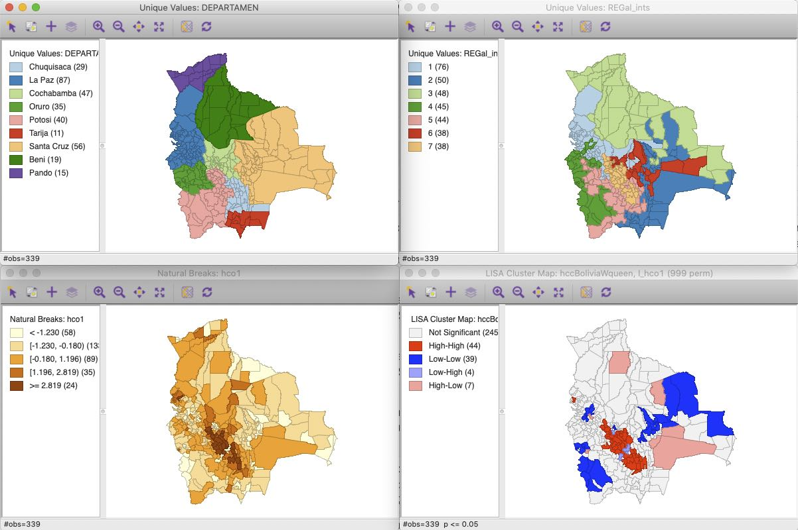

# Five human capital constraints across the municipalities of Bolivia

- Number of cross-sectional units: 339

- Number of years: 1 

- Download dataset: [hccBolivia.zip](download.zip?raw=true) 

- Explore dataset: [Open Tableau Online](https://prod-apnortheast-a.online.tableau.com/t/quarcslab/views/hccBolivia-5-Human-Capital-Constraints/2Maps?:origin=card_share_link&:embed=n)

- Tutorial: Mapping and Spatial Dependence Analyses in Python 

| Variable   | Definition                                                                                                                                                                                                                                                                                                                                                                |
|------------|---------------------------------------------------------------------------------------------------------------------------------------------------------------------------------------------------------------------------------------------------------------------------------------------------------------------------------------------------------------------------|
| POLY_ID    | Polygon ID created from GeoDa                                                                                                                                                                                                                                                                                                                                             |
| DEPARTAMEN | Name of department                                                                                                                                                                                                                                                                                                                                                        |
| mun        | Name of municipality                                                                                                                                                                                                                                                                                                                                                      |
| pop_20     | Population (Projected for 2020)                                                                                                                                                                                                                                                                                                                                           |
| s2_2_dm    | **Chronic malnutrition in children:** This indicator measures the percentage   of kids under five years with chronic malnutrition in the year 2016. This   indicator is weighted by department and poverty level. The original source of   the data is the Survey of Demography and Health of 2016 (Encuesta de   Demografía y Salud 2016).                                   |
| s4_1_ash   | **Secondary dropout rate of males:** This indicator measures the number of   male students dropping out from secondary school as a percentage of   matriculation. The original source is the Ministry of Education's Educational   Statistics and Indicators System (Sistema de Estadísticas e Indicadores   Educativos 2017                                                  |
| s4_1_asm   | **Secondary dropout rate of females:** This indicator measures the number of   female students dropping out from secondary school as a percentage of   matriculation. The original source is the Ministry of Education's Educational   Statistics and Indicators System (Sistema de Estadísticas e Indicadores   Educativos 2017)                                             |
| s10_2_egin | **Gini coefficient of years of education:** This indicator measures the Gini   coefficient, measuring inequality, in the years of schooling for the   population in the segment of 25 to 65 years old. The original source are   estimations by \citep{SDSN-Bolivia2020} based on data from the Census of   Population and Housing 2012 (Censo de Población y Vivienda 2012). |
| s10_2_nhe  | **Non-Spanish speaking population: This indicator measures the percentage**   of the population, three years old or older, that do not have Spanish as   their mother tongue, first or second language. The original source is the   Census of Population and Housing 2012 (Censo de Población y Vivienda 2012)                                                               |
| hco1       | **First principal component of the previos 5 indicators**                                                                                                                                                                                                                                                                                                                     |
| REGs22dm   | Max P regionalization scheme for chronic malnutrition in children                                                                                                                                                                                                                                                                                                         |
| REGs41ash  | Max P regionalization scheme for dropout rate of secondary dropout rate   of males                                                                                                                                                                                                                                                                                        |
| REGs41asm  | Max P regionalization scheme for dropout rate of secondary dropout rate   of females                                                                                                                                                                                                                                                                                      |
| REG102egin | Max P regionalization scheme for education inequality                                                                                                                                                                                                                                                                                                                     |
| REG102nhe  | Max P regionalization scheme for non-spanish speking population                                                                                                                                                                                                                                                                                                           |
| REGal_ints | Max P regionalization scheme of the first principal component of the   previous 5 indicators                                                                                                                                                                                                                                                                              |

Source: [Municipal Atlas of the SDGs in Bolivia](https://www.sdsnbolivia.org/en/sdsn-presenta-avances-en-el-atlas-municipal-de-los-ods-en-bolivia-a-la-empresa-privada-boliviana/
)
